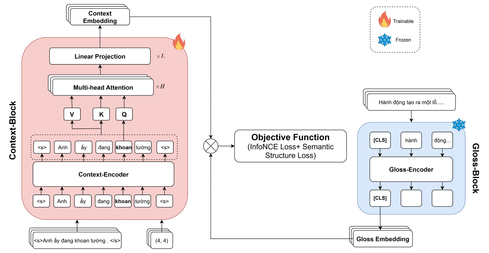

# ViConBERT: Context-Gloss Aligned Vietnamese Word Embedding for Polysemous and Sense-Aware Representations
[Model](https://huggingface.co/tkhangg0910/viconbert-base)  $~$  [Paper](https://huggingface.co/tkhangg0910/viconbert-base)

This repository is official implementation of the paper: ViConBERT: Context-Gloss Aligned Vietnamese Word Embedding for Polysemous and Sense-Aware Representations


<p align="center"><em>Main architecture</em></p>

* **Abstract:**
Recent progress in contextualized word embeddings has significantly advanced tasks involving word semantics, such as Word Sense Disambiguation (WSD) and contextual semantic similarity. However, these developments have largely focused on high-resource languages like English, while low-resource languages such as Vietnamese remain underexplored. This paper introduces a novel training framework for Vietnamese contextualized word embeddings, which integrates contrastive learning (SimCLR) and distillation with the gloss embedding space to better model word meaning. Additionally, we introduce a new dataset specifically designed to evaluate semantic understanding tasks in Vietnamese, which we constructed as part of this work. Experimental results demonstrate that ViConBERT outperforms strong baselines on the WSD task (F1 = 0.87) and achieves competitive results on ViCon (AP = 0.88) and ViSim-400 (Spearman’s $\rho$ = 0.60), effectively modeling both binary and graded semantic relations in Vietnamese.


### ViConBERT models <a name="models2"></a>

Model | #params | Arch.	 | Max length | Training data | License
---|---|---|---|---|---
[`tkhangg0910/viconbert-base`](https://huggingface.co/tkhangg0910/viconbert-base) | 135M | base | 256 | ViConWSD 
[`tkhangg0910/viconbert-large`](https://huggingface.co/tkhangg0910/viconbert-large) | 370M | large | 256 | ViConWSD 
### Example usage <a name="usage2"></a>
SpanExtractor and text_normalize are implemented in [`Implementation`](https://github.com/tkhangg0910/ViConBERT/tree/main/utils) 
```python
import logging
from typing import Optional, Tuple
import re
from transformers import AutoModel, PhobertTokenizerFast

from utils.span_extractor import SpanExtractor
from utils.process_data import text_normalize
import torch

model = AutoModel.from_pretrained("tkhangg0910/viconbert-base", trust_remote_code=True)
tokenizer = PhobertTokenizerFast.from_pretrained("tkhangg0910/viconbert-base")

span_ex =SpanExtractor(tokenizer)

def pipeline(query, target):
  query_norm=text_normalize(query)
  tokenized_query = tokenizer(query_norm,return_tensors="pt").to(device)
  span_idx = span_ex.get_span_indices(query_norm, target)
  span =torch.Tensor(span_idx).unsqueeze(0).to(device)
  model.eval()
  query_vec = model(tokenized_query, span)
  return query_vec

# Honosemous word: "Khoan" example
query_1 = "Tôi đang khoan."
target_1 = "Khoan"
query_vec_1 = pipeline(query_1, target_1)

query_2 = "khoan này bị mất mũi khoan."
target_2 = "mũi khoan"
query_vec_2 = pipeline(query_2, target_2)

query_3 = "Khoan là việc rất tiện lợi."
target_3 = "Khoan"
query_vec_3 = pipeline(query_3, target_3)


def cosine_similarity(vec1, vec2):
    return F.cosine_similarity(vec1, vec2, dim=1).item()


sim_1 = cosine_similarity(query_vec_1, query_vec_3)
sim_2 = cosine_similarity(query_vec_2, query_vec_3)

print(f"Similarity between 1: {target_1}  and  3: {target_3}: {sim_1:.4f}")
print(f"Similarity between 2: {target_2} and 3:{target_3}: {sim_2:.4f}")
```
