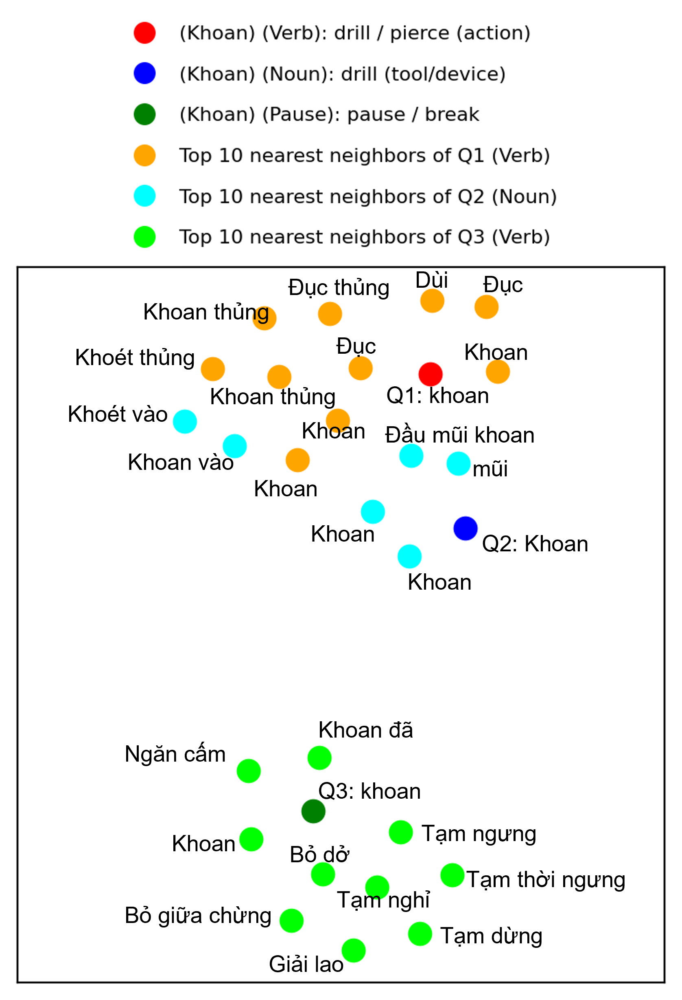
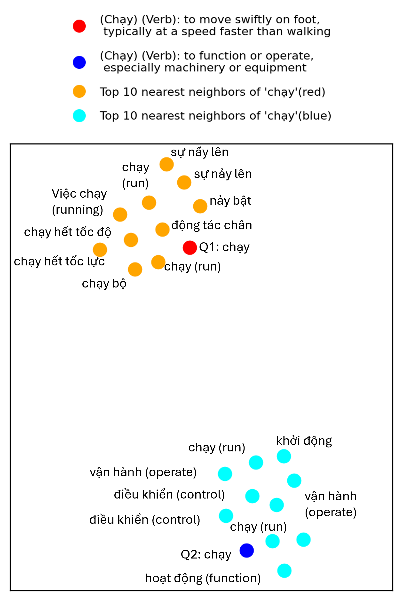
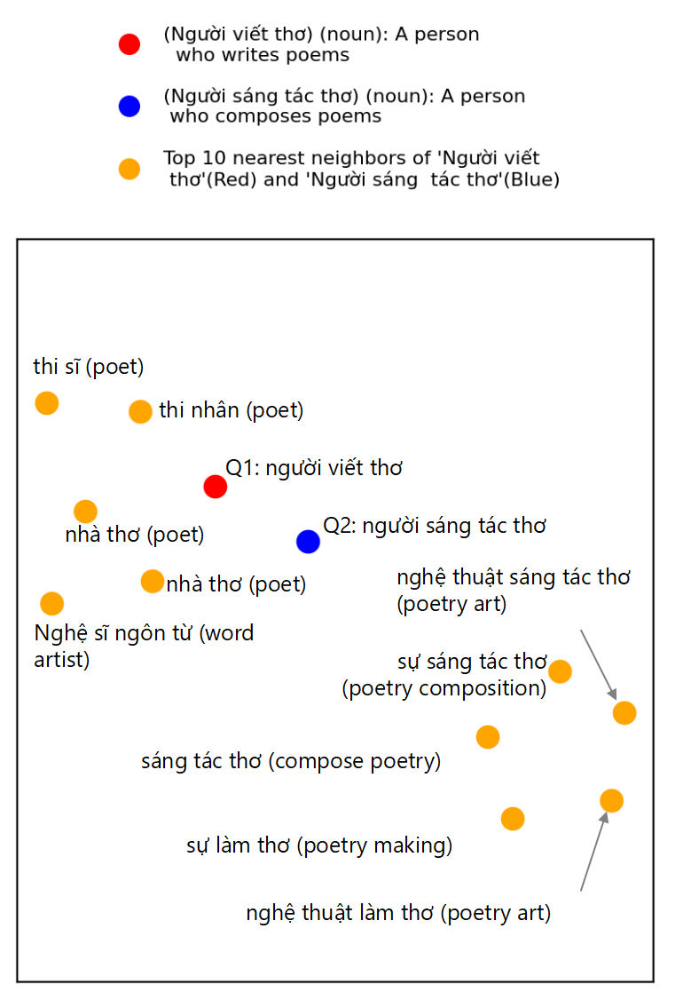

# ViConBERT: Context-Gloss Aligned Vietnamese Word Embedding for Polysemous and Sense-Aware Representations
[Model](https://huggingface.co/tkhangg0910/viconbert-base)  $~$  [Paper](https://huggingface.co/tkhangg0910/viconbert-base) $~$  [Dataset](https://huggingface.co/datasets/tkhangg0910/ViConWSD)

This repository is official implementation of the paper: ViConBERT: Context-Gloss Aligned Vietnamese Word Embedding for Polysemous and Sense-Aware Representations


<p align="center"><em>Main architecture</em></p>

* **Abstract:**
Recent progress in contextualized word embeddings has significantly advanced tasks involving word semantics, such as Word Sense Disambiguation (WSD) and contextual semantic similarity. However, these developments have largely focused on high-resource languages like English, while low-resource languages such as Vietnamese remain underexplored. This paper introduces a novel training framework for Vietnamese contextualized word embeddings, which integrates contrastive learning (SimCLR) and distillation with the gloss embedding space to better model word meaning. Additionally, we introduce a new dataset specifically designed to evaluate semantic understanding tasks in Vietnamese, which we constructed as part of this work. Experimental results demonstrate that ViConBERT outperforms strong baselines on the WSD task (F1 = 0.87) and achieves competitive results on ViCon (AP = 0.88) and ViSim-400 (Spearman’s $\rho$ = 0.60), effectively modeling both binary and graded semantic relations in Vietnamese.

### Installation <a name="install2"></a>
- Install `transformers` with pip: `pip install transformers`, or [install `transformers` from source](https://huggingface.co/docs/transformers/installation#installing-from-source).  <br /> 
Note that we merged a slow tokenizer for PhoBERT into the main `transformers` branch. The process of merging a fast tokenizer for PhoBERT is in the discussion, as mentioned in [this pull request](https://github.com/huggingface/transformers/pull/17254#issuecomment-1133932067). If users would like to utilize the fast tokenizer, the users might install `transformers` as follows:

```
git clone --single-branch --branch fast_tokenizers_BARTpho_PhoBERT_BERTweet https://github.com/datquocnguyen/transformers.git
cd transformers
pip3 install -e .
```

- Install others dependencies [`requirements`](https://github.com/tkhangg0910/ViConBERT/blob/main/requirements.txt)  :
```
pip3 install -r requirements.txt
```


### ViConBERT models <a name="models2"></a>


Model | #params | Arch. | Max length | Training data
---|---|---|---|---
[`tkhangg0910/viconbert-base`](https://huggingface.co/tkhangg0910/viconbert-base) | 135M | base | 256 | [ViConWSD](https://huggingface.co/datasets/tkhangg0910/ViConWSD)
[`tkhangg0910/viconbert-large`](https://huggingface.co/tkhangg0910/viconbert-large) | 370M | large | 256 | [ViConWSD](https://huggingface.co/datasets/tkhangg0910/ViConWSD)


### Example usage <a name="usage2"></a>
SpanExtractor and text_normalize are implemented in [`code`](https://github.com/tkhangg0910/ViConBERT/tree/main/utils) 
```python
import logging
from typing import Optional, Tuple
import re
from transformers import AutoModel, PhobertTokenizerFast,AutoTokenizer
import torch.nn.functional as F

from utils.span_extractor import SpanExtractor
from utils.process_data import text_normalize
import torch

model = AutoModel.from_pretrained(
    "tkhangg0910/viconbert-base",
    trust_remote_code=True,
    ignore_mismatched_sizes=True
)
tokenizer = AutoTokenizer.from_pretrained("tkhangg0910/viconbert-base", use_fast=True)

span_ex =SpanExtractor(tokenizer)

def pipeline(query, target):
  query_norm=text_normalize(query)
  tokenized_query = tokenizer(query_norm,return_tensors="pt").to(device)
  span_idx = span_ex.get_span_indices(query_norm, target)
  span =torch.Tensor(span_idx).unsqueeze(0).to(device)
  model.eval()
  query_vec = model(tokenized_query, span)
  return query_vec

# Example: Homonyms: "Khoan" 
query_1 = "Tôi đang khoan."
target_1 = "Khoan"
query_vec_1 = pipeline(query_1, target_1)

query_2 = "khoan này bị mất mũi khoan."
target_2 = "khoan"
query_vec_2 = pipeline(query_2, target_2)

query_3 = "Khoan là việc rất tiện lợi."
target_3 = "Khoan"
query_vec_3 = pipeline(query_3, target_3)


def cosine_similarity(vec1, vec2):
    return F.cosine_similarity(vec1, vec2, dim=1).item()


sim_1 = cosine_similarity(query_vec_1, query_vec_3)
sim_2 = cosine_similarity(query_vec_2, query_vec_3)

print(f"Similarity between 1: {target_1}  and  3: {target_3}: {sim_1:.4f}")
print(f"Similarity between 2: {target_2} and 3:{target_3}: {sim_2:.4f}")
```
### Embedding Space Visualization

<p align="center">
  
  
  
</p>

<p align="center">
  <em>Contextual separation of "Khoan", "chạy", and zero-shot ability for unseen words</em>
</p>
